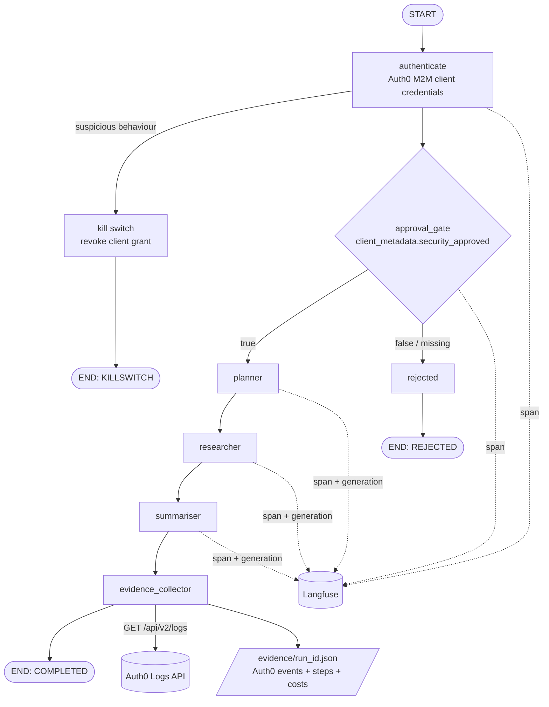

# Agent Identity Gateway

A reference implementation showing that a personal AI agent can be a first-class,
governable identity in an enterprise IdP. The agent is registered in Auth0 as a
machine-to-machine application; before doing any work it must authenticate with
its own client credentials and pass an approval gate controlled by a security
admin (a `security_approved` flag in its Auth0 metadata). Every step of the
agent's LangGraph pipeline is traced in Langfuse with token counts and cost, and
every run ends with a single evidence JSON that joins the Auth0 audit log (who
authenticated, when, with what scope) with the Langfuse trace (what the agent
actually did with that access). A kill-switch path revokes the agent's client
grant if suspicious token-request behaviour is detected.

## Architecture



## Quickstart

```bash
git clone <this-repo> && cd Agent-Identity
python3 -m venv .venv && source .venv/bin/activate
pip install -r requirements.txt

cp .env.example .env        # fill in the secrets (or export them in your shell)
gcloud auth application-default login   # LLM runs on Vertex AI via ADC

python main.py --status     # check the approval flag
python main.py              # full run
python main.py --topic "your own research topic"
```

## How to approve the agent (for a security admin)

1. Go to `manage.auth0.com`
2. Applications → *your agent's M2M application* → Settings
3. Scroll to **Application Metadata**
4. Add key `security_approved` with value `true` → Save

Set it to `false` (or delete it) to block the agent again. No code changes,
no redeploy — the gate is checked live at the start of every run.

## A real run

Console output from an actual approved run against a live Auth0 tenant,
Vertex AI (Gemini Flash), and Langfuse Cloud (identifiers redacted):

```
[auth0] token acquired: type=Bearer expires_in=86400s scope='read:client_grants read:logs read:clients'
╭─────────────────────────── approval gate ───────────────────────────╮
│ APPROVED — Agent is approved — security_approved=true in Auth0      │
╰─────────────────────────────────────────────────────────────────────╯
━━━━━━━━━━━━━━━━━━━━━━━━━━━━━━━━━━━━━━━━━━━━━━━━━━━━━
  AGENT IDENTITY GATEWAY — Run f44a18a9
━━━━━━━━━━━━━━━━━━━━━━━━━━━━━━━━━━━━━━━━━━━━━━━━━━━━━
  Auth0 Identity : <tenant>.us.auth0.com
  Client ID      : <agent-m2m-client-id>
  Approved       : ✓ YES (security_approved=true)
  Task           : identity-first security for autonomous AI agents
  Outcome        : COMPLETED
  Total Cost     : $0.0003
  Langfuse Trace : https://us.cloud.langfuse.com/trace/f685413b...
  Evidence File  : evidence/run_f44a18a9.json
  Killswitch     : NOT FIRED
━━━━━━━━━━━━━━━━━━━━━━━━━━━━━━━━━━━━━━━━━━━━━━━━━━━━━
```

The full evidence record from this run is committed at
[`evidence/sample_run.json`](evidence/sample_run.json) (tenant identifiers and
IP redacted). The two layers are both visible in it:

- **Identity layer** — `auth0_logs[0]` is the raw `seccft` event from the
  tenant's audit log: the successful client-credentials exchange, with the
  agent's client ID, the granted scopes, and the timestamp. This is Auth0's
  proof that a registered, approved identity authenticated.
- **Execution layer** — `steps[]` records every node that ran (authenticate,
  approval gate, planner, researcher, summariser, evidence collector) with
  per-node LLM cost, and `langfuse_trace_url` links to the full trace where
  each node is a span and each LLM call is a generation with token counts.
  Total run cost: **$0.000256**.

And when the security admin flips the flag to `false`, the same command
produces the other half of the story:

```
╭─────────────────────────── approval gate ───────────────────────────╮
│ BLOCKED                                                             │
│ security_approved = false                                           │
│ Agent is pending approval — set security_approved=true in Auth0     │
│                                                                     │
│ Approve here:                                                       │
│ https://manage.auth0.com/dashboard/us/<tenant>/applications/...     │
│ → Application Metadata → security_approved = true                   │
╰─────────────────────────────────────────────────────────────────────╯
  Outcome        : REJECTED
```

No code change, no redeploy: the agent is governed live from the Auth0
dashboard, and both outcomes leave an evidence trail.

## Reading the evidence JSON

Each run writes `evidence/run_<id>.json`:

| Key | Meaning |
|---|---|
| `run_id`, `started_at`, `completed_at` | Run identity and time window |
| `task_topic` | What the agent was asked to research |
| `outcome` | `COMPLETED`, `REJECTED`, `KILLSWITCH`, or `ERROR` |
| `auth0_client_id`, `auth0_domain` | The agent's registered identity |
| `security_approved` | The approval flag value at run time |
| `langfuse_trace_url` | Deep link to the full execution trace |
| `total_cost_usd` | Sum of all LLM call costs in this run |
| `killswitch_fired` | Whether the suspicious-behaviour rule triggered |
| `steps` | One entry per graph node that ran, with per-node outputs and costs |
| `auth0_logs` | Raw Auth0 events for this run window (e.g. `seccft` = successful client-credentials exchange) |

## What Auth0 proves vs what Langfuse proves

| Auth0 proves | Langfuse proves |
|---|---|
| The agent authenticated with a valid, registered identity | Every graph node that executed, in order, with timings |
| The exact scopes granted to the token | Every LLM prompt and completion |
| A security admin approved the agent before it ran | Token counts and cost per call and per run |
| The timestamped token-grant event (`seccft`) in the tenant audit log | Errors and where in the pipeline they occurred |
| Revocation events if the kill switch fires | The agent's actual outputs, step by step |

Neither layer alone covers the full picture. Identity without execution tracing
cannot say what the agent did; tracing without identity cannot say who was
allowed to do it. The evidence JSON binds both.

## Known limitations

- The kill switch runs in dry-run mode by default (`KILLSWITCH_DRY_RUN=true`):
  it locates the client grant but does not delete it, so the demo tenant stays
  usable. Set it to `false` for real revocation.
- The suspicious-behaviour rule is a simple counter threshold (>10 token
  requests/60s); enterprise Auth0/Okta adds behavioural detection, anomaly
  scoring, and adaptive policies.
- `AUTH0_MGMT_TOKEN` is a 24-hour test token copied from the dashboard;
  production would use a dedicated M2M app with narrowly scoped, auto-rotated
  mgmt credentials.
- Approval is a single boolean flag; enterprise setups add approval workflows,
  time-boxed grants, and step-up authorization per scope.
- Auth0 log delivery has a short indexing delay, so a run's own `seccft` event
  is fetched with a small window and may occasionally land in the next run's
  evidence instead.

## License

[MIT](LICENSE)
