# Agent Identity Gateway

[](LICENSE)


**A personal AI agent registered as a first-class identity in an enterprise IdP: approval-gated by a security admin, traced step by step, and auditable from a single evidence record.**

This is not another agent framework. It is a working answer to a governance
question: when a personal AI agent acts inside a company, who approved it, what
did it do with that approval, and where is the proof? Here the agent is a
machine-to-machine application in Auth0. It cannot start until a security admin
flips an approval flag in the Auth0 dashboard. Every node of its LangGraph
pipeline lands in Langfuse with token counts and cost. And every run, approved
or blocked, ends with one evidence JSON that binds the Auth0 audit log to the
execution trace.

> Auth0 proves the agent authenticated with a valid identity and an approved
> scope. Langfuse proves what the agent did with that access, step by step, at
> what cost. Neither covers the full picture alone. Together they close the gap.

## Why an identity gateway

Agents today mostly run on ambient API keys: long-lived secrets with no owner,
no approval step, and no revocation story. This build treats the agent the way
an enterprise treats an employee or a service:

| Governance question | How this build answers it |
|---|---|
| Can security approve or block the agent? | `client_metadata.security_approved` flag in Auth0, checked live at the start of every run. No code change, no redeploy. |
| Is there an audit log of the agent's access? | The Auth0 Logs API records every token grant (`seccft` event) with client ID, scopes, and timestamp. Pulled into the evidence record after every run. |
| Can suspicious behaviour be stopped? | A kill-switch path revokes the agent's client grant, immediately blocking new token issuance, and flips the approval flag to false. |
| Can anyone reconstruct what happened? | One evidence JSON per run: identity events, every pipeline step, per-step LLM cost, outcome, and a deep link to the Langfuse trace. |

## Architecture

```mermaid
%%{init: {'theme':'dark', 'themeVariables': {'primaryColor':'#0A161A','primaryBorderColor':'#4FD6E0','primaryTextColor':'#E6EDF3','lineColor':'#4FD6E0','clusterBkg':'#05090B'}}}%%
flowchart TD
    S([START]) --> A[authenticate<br/>Auth0 M2M client credentials]
    A -->|suspicious behaviour| K[kill switch<br/>revoke client grant]
    K --> E1([END: KILLSWITCH])
    A --> G{approval_gate<br/>client_metadata.security_approved}
    G -->|true| P[planner] --> R[researcher] --> SU[summariser] --> EC[evidence_collector] --> E2([END: COMPLETED])
    G -->|false / missing| RJ[rejected] --> E3([END: REJECTED])
    EC -->|GET /api/v2/logs| AL[(Auth0 Logs API)]
    A -.span.-> LF[(Langfuse)]
    G -.span.-> LF
    P -.span + generation.-> LF
    R -.span + generation.-> LF
    SU -.span + generation.-> LF
    EC --> EV[/evidence/run_id.json<br/>Auth0 events + steps + costs/]
    style G fill:#241a05,stroke:#FFC46B,stroke-width:2px
    style K fill:#2a0a0a,stroke:#ff6b6b
    style EV fill:#0a1f14,stroke:#46E39B
```



Design positions:

- **The approval gate is data, not code.** The security team governs the agent
  from the Auth0 dashboard. The agent reads its own metadata and fails closed
  on every ambiguity: flag false, flag missing, or Management API unreachable
  all mean blocked.
- **Raw HTTP for the identity layer.** Token exchange, lifecycle check, log
  retrieval, and revocation are explicit `httpx` calls, not SDK magic, so every
  request in the security path is inspectable.
- **Evidence is unconditional.** The evidence file is written on completion,
  rejection, kill switch, and error. A run that leaves no record is treated as
  a bug; the tests enforce it.
- **The kill switch defaults to dry run** (`KILLSWITCH_DRY_RUN=true`): it
  locates the client grant but does not delete it, so a demo tenant is never
  left broken. One environment variable arms it for real.

## A real run

Console output from an actual approved run against a live Auth0 tenant,
Vertex AI (Gemini Flash), and Langfuse Cloud (identifiers redacted):

```
[auth0] token acquired: type=Bearer expires_in=86400s scope='read:client_grants read:logs read:clients'
╭─────────────────────────── approval gate ───────────────────────────╮
│ APPROVED — Agent is approved — security_approved=true in Auth0      │
╰─────────────────────────────────────────────────────────────────────╯
━━━━━━━━━━━━━━━━━━━━━━━━━━━━━━━━━━━━━━━━━━━━━━━━━━━━━
  AGENT IDENTITY GATEWAY — Run f44a18a9
━━━━━━━━━━━━━━━━━━━━━━━━━━━━━━━━━━━━━━━━━━━━━━━━━━━━━
  Auth0 Identity : <tenant>.us.auth0.com
  Client ID      : <agent-m2m-client-id>
  Approved       : ✓ YES (security_approved=true)
  Task           : identity-first security for autonomous AI agents
  Outcome        : COMPLETED
  Total Cost     : $0.0003
  Langfuse Trace : https://us.cloud.langfuse.com/trace/f685413b...
  Evidence File  : evidence/run_f44a18a9.json
  Killswitch     : NOT FIRED
━━━━━━━━━━━━━━━━━━━━━━━━━━━━━━━━━━━━━━━━━━━━━━━━━━━━━
```

The full evidence record from this run is committed at
[`evidence/sample_run.json`](evidence/sample_run.json), with tenant identifiers
and IP redacted. Both layers are visible in it:

| Layer | Where it lives in the record | What it proves |
|---|---|---|
| Identity | `auth0_logs[0]`: the raw `seccft` event from the tenant audit log | A registered, approved identity performed the client-credentials exchange, with these exact scopes, at this timestamp |
| Execution | `steps[]` plus `langfuse_trace_url` | Every node that ran, in order, with per-node LLM cost; each node is a span and each LLM call is a generation with token counts. Total run cost: $0.000256 |

When the security admin flips the flag to `false`, the same command produces
the other half of the story:

```
╭─────────────────────────── approval gate ───────────────────────────╮
│ BLOCKED                                                             │
│ security_approved = false                                           │
│ Agent is pending approval — set security_approved=true in Auth0     │
│                                                                     │
│ Approve here:                                                       │
│ https://manage.auth0.com/dashboard/us/<tenant>/applications/...     │
│ → Application Metadata → security_approved = true                   │
╰─────────────────────────────────────────────────────────────────────╯
  Outcome        : REJECTED
```

No code change, no redeploy: the agent is governed live from the Auth0
dashboard, and both outcomes leave an evidence trail.

## Quick start

```bash
# clone and install
git clone https://github.com/mailtotanvir/Agent-Identity.git && cd Agent-Identity
python3 -m venv .venv && source .venv/bin/activate
pip install -r requirements.txt

# configure: Auth0 M2M app + Langfuse keys + GCP project
cp .env.example .env                    # fill in your values
gcloud auth application-default login   # the LLM runs on Vertex AI via ADC

# run
python main.py --status                 # check the approval flag
python main.py                          # full governed run
python main.py --topic "your own research topic"
```

Auth0 setup, once: create a machine-to-machine application, authorize it for
the Auth0 Management API with `read:clients read:client_grants read:logs`, and
put its domain, client ID, and client secret in `.env`.

## How to approve the agent (for a security admin)

1. Go to `manage.auth0.com`
2. Applications, then your agent's M2M application, then Settings
3. Scroll to **Application Metadata**
4. Add key `security_approved` with value `true`, then Save

Set it to `false` (or delete it) to block the agent again. The gate is checked
live at the start of every run.

## Reading the evidence JSON

Each run writes `evidence/run_<id>.json`:

| Key | Meaning |
|---|---|
| `run_id`, `started_at`, `completed_at` | Run identity and time window |
| `task_topic` | What the agent was asked to research |
| `outcome` | `COMPLETED`, `REJECTED`, `KILLSWITCH`, or `ERROR` |
| `auth0_client_id`, `auth0_domain` | The agent's registered identity |
| `security_approved` | The approval flag value at run time |
| `langfuse_trace_url` | Deep link to the full execution trace |
| `total_cost_usd` | Sum of all LLM call costs in this run |
| `killswitch_fired` | Whether the suspicious-behaviour rule triggered |
| `steps` | One entry per graph node that ran, with per-node outputs and costs |
| `auth0_logs` | Raw Auth0 events for this run window (`seccft` = successful client-credentials exchange) |

## What Auth0 proves vs what Langfuse proves

| Auth0 proves | Langfuse proves |
|---|---|
| The agent authenticated with a valid, registered identity | Every graph node that executed, in order, with timings |
| The exact scopes granted to the token | Every LLM prompt and completion |
| A security admin approved the agent before it ran | Token counts and cost per call and per run |
| The timestamped token-grant event (`seccft`) in the tenant audit log | Errors and where in the pipeline they occurred |
| Revocation events if the kill switch fires | The agent's actual outputs, step by step |

Neither layer alone covers the full picture. Identity without execution tracing
cannot say what the agent did; tracing without identity cannot say who was
allowed to do it. The evidence JSON binds both.

## Repository map

| Path | What it is |
|---|---|
| [`main.py`](main.py) | Entry point: `--status`, `--approve`, `--topic`, final run panel |
| [`auth0/auth.py`](auth0/auth.py) | OAuth 2.0 client-credentials token exchange, raw httpx |
| [`auth0/lifecycle.py`](auth0/lifecycle.py) | The approval gate: reads `security_approved` from client metadata |
| [`auth0/logs.py`](auth0/logs.py) | Pulls the tenant audit log for the run window |
| [`auth0/killswitch.py`](auth0/killswitch.py) | Suspicious-behaviour rule and client-grant revocation |
| [`graph/graph.py`](graph/graph.py) | LangGraph StateGraph: gate routing, error routing |
| [`graph/nodes.py`](graph/nodes.py) | The seven nodes, evidence writer, outcome derivation |
| [`langfuse_client/tracing.py`](langfuse_client/tracing.py) | Trace init, node spans, generations with cost |
| [`evidence/sample_run.json`](evidence/sample_run.json) | Redacted evidence record from a real completed run |
| [`tests/`](tests/) | 14 tests, all external calls mocked: auth, gate, graph paths, evidence schema |

## Known limitations

- The kill switch runs in dry-run mode by default; set `KILLSWITCH_DRY_RUN=false`
  for real revocation.
- The suspicious-behaviour rule is a simple counter threshold (more than 10
  token requests in 60 seconds). Enterprise Auth0/Okta adds behavioural
  detection, anomaly scoring, and adaptive policies.
- `AUTH0_MGMT_TOKEN` is a 24-hour test token copied from the dashboard.
  Production would use a dedicated M2M app with narrowly scoped, auto-rotated
  management credentials.
- Approval is a single boolean flag. Enterprise setups add approval workflows,
  time-boxed grants, and step-up authorization per scope.
- Auth0 log delivery has a short indexing delay, so a run's own `seccft` event
  may occasionally land in the next run's evidence window instead.

## License

[MIT](LICENSE)
